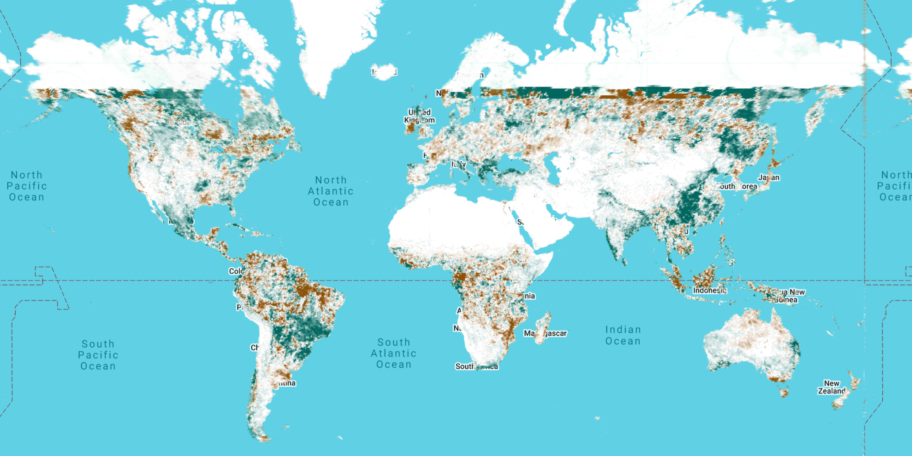

# Vegetation and Vegetation Change Analysis: From Local to Global

In this tutorial, we will walk you through a global to local analysis of vegetation change using Google Earth Engine (GEE).

## Introduction

Understanding vegetation and its change over time helps in monitoring ecological health, land use planning, and managing natural resources. This tutorial will introduce you to the steps required to analyze and visualize vegetation and vegetation change using satellite data in GEE. A focus will be on exploring how easy it is to scale your workflow to perform planetary-scale analysis using the platform.

## Local Analysis: Chicago

This section covers the analysis of vegetation using the Normalized Difference Vegetation Index (NDVI) in Chicago.

### Loading Data

First, load the feature collection of Chicago's census tracts from user assets while adding a water mask to exclude water-covered areas.

```javascript

//*******This script should be run on the Google Earth Engine Javascript API (https://earthengine.google.com/)*********//

var ROI = ee.FeatureCollection('users/tirthankar25/chicago')
var Water = ee.Image("JRC/GSW1_4/GlobalSurfaceWater").select("occurrence");

print(ROI)
Map.addLayer(ROI, {}, "Chicago Shapefile") 
Map.setCenter(-87.679, 41.847, 10)
```
The feature collection has been added to the map and can be interacted with using the GUI.


### Working with MODIS Data
#### Load the MODIS image collection and filter it for NDVI data.

Here, we will use a day of year filter to only consider the images for northern hemisphere summer and limit our overall analysis to the years 2014 to 2018 (both inclusive).

To convert the digital number in the derived product to NDVI, we are multiplying by the scaling factor.

```javascript
var MODIS = ee.ImageCollection('MODIS/061/MOD13A1');
print(MODIS)

var SumFilter = ee.Filter.dayOfYear(152, 273);
var NDVI = MODIS.select('NDVI')
var NDVI_dateofint = NDVI.filterDate('2014-01-01', '2018-12-30').filter(SumFilter);

var NDVI_mean = NDVI_dateofint.mean()
var NDVI_final = NDVI_mean.multiply(.0001)
var NDVI_Chicago = NDVI_final.clip(ROI).updateMask(Water.mask().not())
Map.addLayer(NDVI_Chicago, {min:.2, max:.6, palette:['#8c510a','#d8b365','#f6e8c3','#f5f5f5','#c7eae5','#5ab4ac','#01665e'].reverse()},"Pixelwise NDVI")
```
The processed NDVI image is added to the map, and you can clearly see the spatial variability of the NDVI at the pixel level:


### Reducing Data by Region
#### Calculate spatial mean NDVI values for each census tract.

Here, we will focus on estimating the mean NDVI of each census tract instead of using the pixel-level data. This will be done through a function that can be mapped over the Chicago feature collection. The reduceRegion operation within the function outputs the mean NDVI within the feature (specified through the reducer argument to the operation), and this mean NDVI is added as a new property to the feature.

```javascript
function Neighborhood_mean(feature) {
  var reduced_NDVI = NDVI_Chicago.reduceRegion({ reducer: ee.Reducer.mean(), geometry: feature.geometry(), scale: 500 })
  return feature.set({ 'NDVI': reduced_NDVI.get('NDVI') })
}

var Reduced = ROI.map(Neighborhood_mean)
print(Reduced)

var NDVI_MODIS = Reduced.reduceToImage({ properties: ee.List(['NDVI']), reducer: ee.Reducer.first() })
print(NDVI_MODIS)
Map.addLayer(NDVI_MODIS, {min:.2, max:.6, palette:['#8c510a','#d8b365','#f6e8c3','#f5f5f5','#c7eae5','#5ab4ac','#01665e'].reverse()},"Aggregated NDVI")
```
We convert the newly added NDVI property into an image to make the visualization easier.
When we add this aggregated NDVI image to the map, we can still see the variability by census tract, but the pixel-level variability within each tract has been averaged out:


### Export Data
#### Export the data as images or tables for further analysis.

Finally, we can export these datasets, both the feature collection and the image, to our Google Drive for offline analysis.

```javascript
Export.image.toDrive({ image: NDVI_MODIS, description: 'Chicago_NDVI', folder: 'Workshop', region: ROI.geometry().bounds(), scale: 500 })
Export.table.toDrive({ collection: Reduced, description: 'Chicago_censustracts', folder: 'Workshop', fileFormat: 'CSV' })
```

## Global Analysis: Tree Cover Change
### Now, let's analyze global tree cover change between 2001 and 2015.

Basically, we will scale our analysis globally and focus on the change in tree cover between 2001 and 2015.

### Loading Data
#### Load the MODIS tree cover data for the years 2001 and 2015.

To estimate the change, we first calculate annual mean percent tree cover from the MODIS continuous vegetation field product for 2001 and 2015.

```javascript
var MODIS = ee.ImageCollection("MODIS/061/MOD44B");
var TREE = MODIS.select('Percent_Tree_Cover')

var TREE_2001 = TREE.filterDate('2001-01-01', '2001-12-31').mean()
var TREE_2015 = TREE.filterDate('2015-01-01', '2015-12-31').mean()
```

### Calculating Change
#### Compute the change in tree cover between 2001 and 2015 on a continuous scale.

The difference between the two images gives the change in tree cover percentage between these years.

```javascript
var TREE_change = TREE_2015.subtract(TREE_2001);
Map.addLayer(TREE_change,{min:-10, max:10, palette:['#8c510a',"white", '#01665e']})
```

When we add this change image to the map, we can see the pixel-level variability, which includes a lot of noise at that scale.



#### Compute the direction of change in tree cover between 2001 and 2015.

Instead of estimating the magnitude of change, let us try to only get the direction of change between the two years. For this, we remap the image using a mask for the tree change greater than 0, equal to 0, or less than 0. For pixels that remain after masking, a default value (1, 0, or -1) is assigned to represent an increase, no change, or a decrease.

These three images are then mosaiced to form the overall change image for the world.

```javascript
var TREE_increase = TREE_change.remap({ from: ee.List([-999]), to: ee.List([-999]), defaultValue: 1 }).mask(TREE_change.gt(0))
var TREE_same = TREE_change.remap({ from: ee.List([-999]), to: ee.List([-999]), defaultValue: 0 }).mask(TREE_change.eq(0))
var TREE_decrease = TREE_change.remap({ from: ee.List([-999]), to: ee.List([-999]), defaultValue: -1 }).mask(TREE_change.lt(0))

var TREE_FINAL = ee.ImageCollection([TREE_increase.float(), TREE_same.float(), TREE_decrease.float()]).mosaic()
Map.addLayer(TREE_FINAL,{min:-1, max:1, palette:['#8c510a',"white", '#01665e']})
```

When we add this newly created image, the direction of change is more clearly visible for different parts of the globe.


### Exporting Data
#### Export the final tree cover change map.

Similar to the local scale analysis, we export the image for offline analysis. To do so globally, we first create a rectangular global region of interest.

```javascript
var ROI = ee.Geometry.Rectangle(-180, -90, 180, 90);
var ROI = ee.Geometry(ROI, null, false);

Export.image.toDrive({ image: TREE_FINAL, description: 'TREE_FINAL_image', folder: 'OEFS', region: ROI, scale: 250 })
```

The interesting part of this exercise is how easy it is to scale this analysis globally, something that would be quite storage and compute consuming in a desktop environment. Now that we are done with this exercise, we can consider extending this kind of analysis to other regions and variables. For instance, you can easily upload your own shapefile using GEE's asset upload feature and replace the path to the asset in the first (local NDVI analysis) example.


# Other exercises
Some opportunities for further exploration and analysis:
1. Try doing a similar analysis for your region or city of interest by ingesting your own shapefile.
2. Consider changes in other variables, either over your region of interest, or globally. How about Land Surface Temperature or Aerosol Optical Depth or impervious land?
